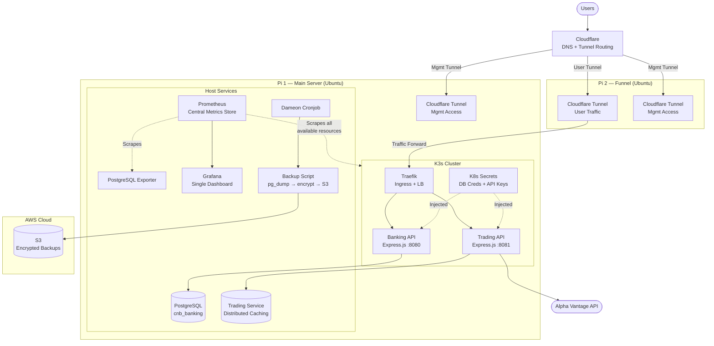

# CNB-Bank Documentation

Homelab, cloud infrastructure, and a distributed caching system powering a banking/trading service.

## System Overview

```mermaid
---
config:
  layout: dagre
---
flowchart TB
 subgraph Pi2["Pi 2 — Funnel (Ubuntu)"]
        CFT2["Cloudflare Tunnel<br>User Traffic"]
        CFMT2["Cloudflare Tunnel<br>Mgmt Access"]
  end
 subgraph K3s["K3s Cluster"]
        Traefik["Traefik<br>Ingress + LB"]
        Banking["Banking API<br>Express.js :8080"]
        Trading["Trading API<br>Express.js :8081"]
        Secrets["K8s Secrets<br>DB Creds + API Keys"]
  end
 subgraph Host["Host Services"]
        PGB[("PostgreSQL<br>cnb_banking")]
        PGT[("Trading Service<br>Distributed Caching")]
        PGExp["PostgreSQL Exporter"]
        Prom["Prometheus<br>Central Metrics Store"]
        Graf["Grafana<br>Single Dashboard"]
        Backup["Backup Script<br>pg_dump → encrypt → S3"]
        Cron["Dameon Cronjob"]
  end
 subgraph Pi1["Pi 1 — Main Server (Ubuntu)"]
        K3s
        Host
        CFMT["Cloudflare Tunnel<br>Mgmt Access"]
  end
 subgraph AWS["AWS Cloud"]
        S3[("S3<br>Encrypted Backups")]
  end
    Users(["Users"]) --> CF["Cloudflare<br>DNS + Tunnel Routing"]
    CF -- User Tunnel --> CFT2
    CF -- Mgmt Tunnel --> CFMT & CFMT2
    CFT2 -- Traffic Forward --> Traefik
    Traefik --> Banking & Trading
    Secrets -. Injected .-> Banking & Trading
    Banking --> PGB
    Trading --> PGT & AV(["Alpha Vantage API"])
    Cron --> Backup
    Prom -. Scrapes all<br> available resources .-> K3s
    Prom -. Scrapes .-> PGExp
    Prom --> Graf
    Backup --> S3
```
