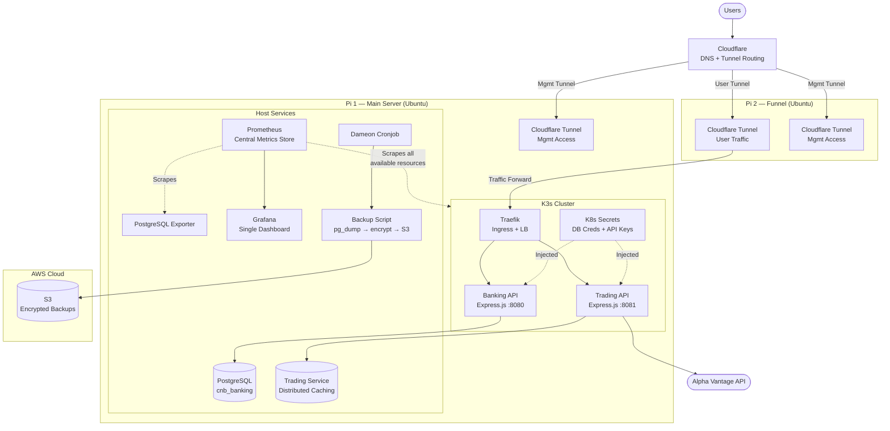
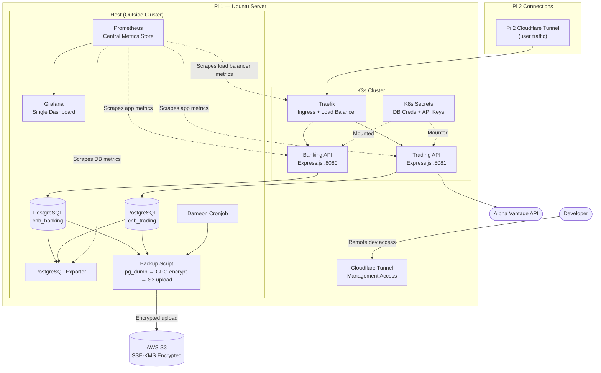
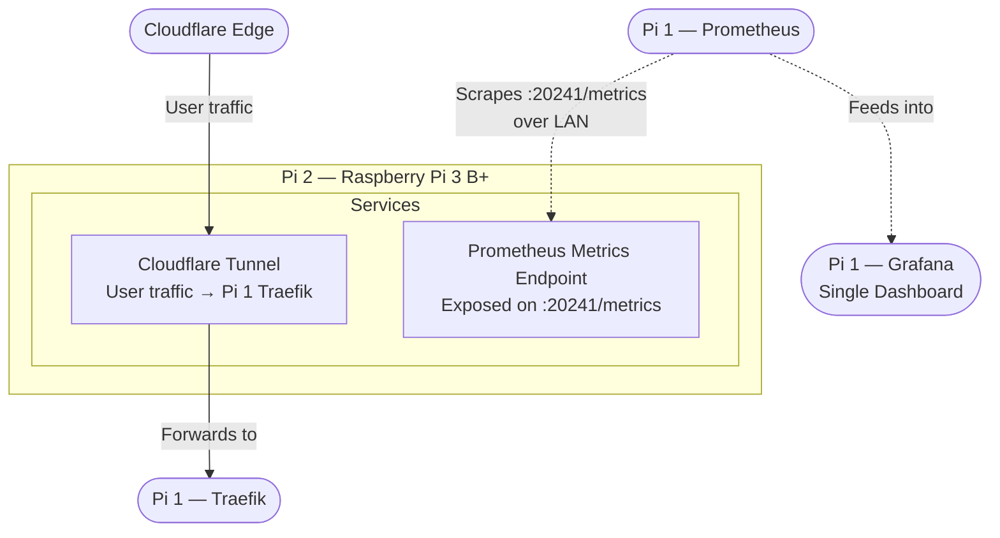

# Raspberry Pis — Overview

### General Architecture Flow

```mermaid
---
config:
  layout: dagre
---
flowchart TB
 subgraph Pi2["Pi 2 — Funnel (Ubuntu)"]
        CFT2["Cloudflare Tunnel<br>User Traffic"]
        CFMT2["Cloudflare Tunnel<br>Mgmt Access"]
  end
 subgraph K3s["K3s Cluster"]
        Traefik["Traefik<br>Ingress + LB"]
        Banking["Banking API<br>Express.js :8080"]
        Trading["Trading API<br>Express.js :8081"]
        Secrets["K8s Secrets<br>DB Creds + API Keys"]
  end
 subgraph Host["Host Services"]
        PGB[("PostgreSQL<br>cnb_banking")]
        PGT[("Trading Service<br>Distributed Caching")]
        PGExp["PostgreSQL Exporter"]
        Prom["Prometheus<br>Central Metrics Store"]
        Graf["Grafana<br>Single Dashboard"]
        Backup["Backup Script<br>pg_dump → encrypt → S3"]
        Cron["Dameon Cronjob"]
  end
 subgraph Pi1["Pi 1 — Main Server (Ubuntu)"]
        K3s
        Host
        CFMT["Cloudflare Tunnel<br>Mgmt Access"]
  end
 subgraph AWS["AWS Cloud"]
        S3[("S3<br>Encrypted Backups")]
  end
    Users(["Users"]) --> CF["Cloudflare<br>DNS + Tunnel Routing"]
    CF -- User Tunnel --> CFT2
    CF -- Mgmt Tunnel --> CFMT & CFMT2
    CFT2 -- Traffic Forward --> Traefik
    Traefik --> Banking & Trading
    Secrets -. Injected .-> Banking & Trading
    Banking --> PGB
    Trading --> PGT & AV(["Alpha Vantage API"])
    Cron --> Backup
    Prom -. Scrapes all<br> available resources .-> K3s
    Prom -. Scrapes .-> PGExp
    Prom --> Graf
    Backup --> S3
```

## PI 1:

```mermaid
---
config:
  layout: dagre
---
flowchart TB
 subgraph K3s["K3s Cluster"]
    direction TB
        Traefik["Traefik<br>Ingress + Load Balancer"]
        Banking["Banking API<br>Express.js :8080"]
        Trading["Trading API<br>Express.js :8081"]
        Secrets["K8s Secrets<br>DB Creds + API Keys"]
  end
 subgraph Host["Host (Outside Cluster)"]
    direction TB
        PG_Banking[("PostgreSQL<br>cnb_banking")]
        PG_Trading[("PostgreSQL<br>cnb_trading")]
        PGExp["PostgreSQL Exporter"]
        Prom["Prometheus<br>Central Metrics Store"]
        Graf["Grafana<br>Single Dashboard"]
        Cron["Dameon Cronjob"]
        BackupScript["Backup Script<br>pg_dump → GPG encrypt → S3 upload"]
  end
 subgraph Pi1["Pi 1 — Ubuntu Server"]
        K3s
        Host
        CFMT["Cloudflare Tunnel<br>Management Access"]
  end
 subgraph Pi2_Inputs["Pi 2 Connections"]
        Pi2_Tunnel["Pi 2 Cloudflare Tunnel<br>(user traffic)"]
  end
    Traefik --> Banking & Trading
    Secrets -. Mounted .-> Banking & Trading
    Banking --> PG_Banking
    Trading --> PG_Trading & AV(["Alpha Vantage API"])
    PG_Banking --> PGExp & BackupScript
    PG_Trading --> PGExp & BackupScript
    Prom -. Scrapes app metrics .-> Banking & Trading
    Prom -. Scrapes load balancer metrics .-> Traefik
    Prom -. Scrapes DB metrics .-> PGExp
    Cron --> BackupScript
    Prom --> Graf
    Pi2_Tunnel --> Traefik
    Dev(["Developer"]) -- Remote dev access --> CFMT
    BackupScript -- Encrypted upload --> S3[("AWS S3<br>SSE-KMS Encrypted")]
```

## PI 2:

```mermaid
flowchart TB
 subgraph Services["Services"]
        CFT["Cloudflare Tunnel<br>User traffic → Pi 1 Traefik"]
        UKProm["Prometheus Metrics Endpoint<br>Exposed on :20241/metrics"]
  end
 subgraph Pi2["Pi 2 — Raspberry Pi 3 B+"]
        Services
  end
    CF(["Cloudflare Edge"]) -- User traffic --> CFT
    CFT -- Forwards to --> Pi1_Traefik(["Pi 1 — Traefik"])
    Pi1_Prom(["Pi 1 — Prometheus"]) -. Scrapes :20241/metrics<br>over LAN .-> UKProm
    Pi1_Prom -. Feeds into .-> Pi1_Graf(["Pi 1 — Grafana<br>Single Dashboard"])
```